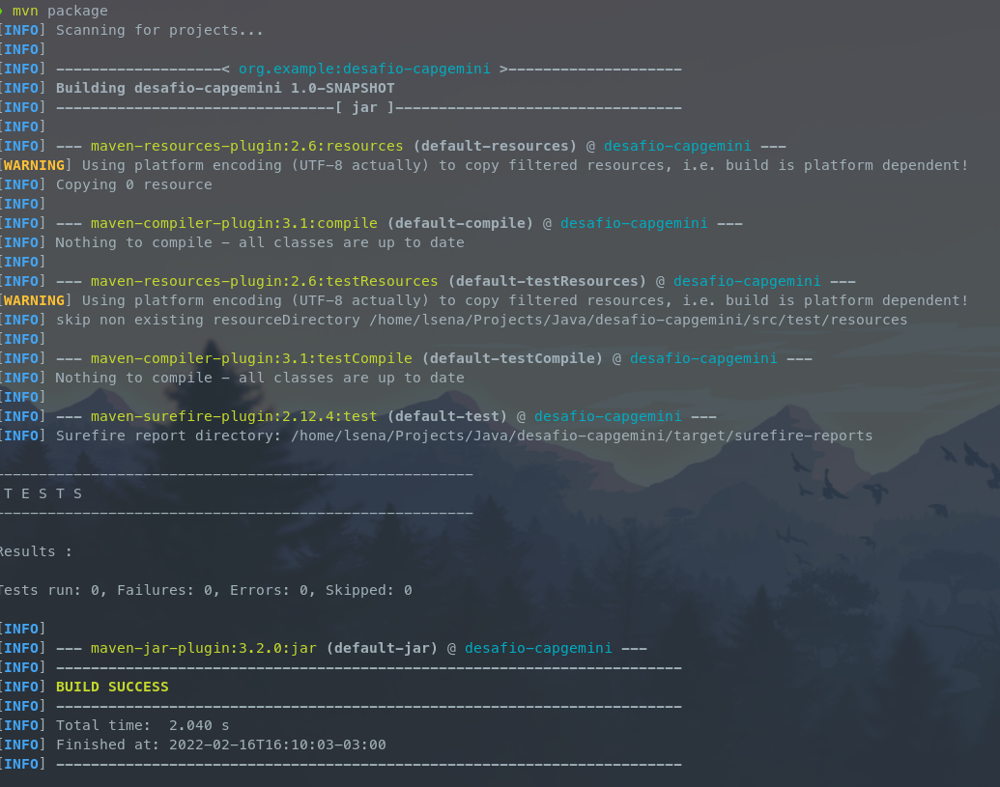
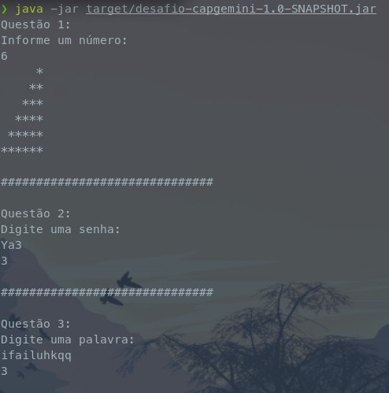

# DESAFIO DE PROGRAMAÇÃO - ACADEMIA CAPGEMINI

## Questão 01

Escreva um algoritmo que mostre na tela uma escada de tamanho n utilizando o caractere * e espaços. A base e altura da escada devem ser iguais ao valor de n. A última linha não deve conter nenhum espaço.
####Exemplo:
#####Entrada:
> n = 6
#####Saída:

```
     *  
    **  
   ***  
  ****  
 *****  
******
```

## Como compilar o programa

```sh
git clone https://gitlab.com/flinthy/desafio-capgemini.git && cd desafio-capgemini

mvn package
```


## Como rodar o programa

```sh
java -jar target/desafio-capgemini-1.0-SNAPSHOT.jar
```


## Tecnologias
- [Java 11](https://docs.oracle.com/en/java/javase/11/)  
- [JUnit 5](https://junit.org/junit5/)  
- [Maven](https://maven.apache.org/index.html)  